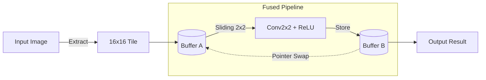

# 🧮 C++ Algorithmic Baseline (`Cpp_code`)

## 📋 Table of Contents
1. [Overview & History](#overview)
2. [Core Concept](#core-concept)
3. [Python MNIST Integration](#mnist-integration)

---

## 📌 Overview & History

The `Cpp_code` directory contains the foundational software implementation of our custom 2D convolution logic. 

We initially developed this code in C++ within a local Windows environment to validate the core mathematical and architectural concepts. Once the algorithmic logic was proven to work, we ported this codebase into a Bare-Metal C driver within the cloud laboratory environment, where we continued all subsequent hardware-software integration.

🔗 **From C++ to Cycle-Accurate Validation:** To see how this initial algorithm evolved into our final simulation and verification framework on the cloud, please refer to the [Simulation README](./../sim/README.md).

---

## 🧱 Core Concept

The primary source file, `pip.cpp`, implements the software equivalent of our intended hardware pipeline. It processes images by extracting fixed-size tiles and passing them through a fused 2x2 convolution and ReLU activation stage. To mimic hardware constraints and avoid dynamic memory allocation, the code utilizes a logical double-buffer mechanism (`bufA` and `bufB`) that swaps pointers after each pipeline depth reduction.

---

## 🐍 Python MNIST Integration (`pipeline.dll`)

To ensure our custom convolution architecture was viable for machine learning, we needed to test its classification accuracy using the MNIST model, which was written in Python. 

Because our convolution logic was written in C++, we wrapped the core processing functions in an `extern "C"` bridge interface and compiled the code into a dynamic link library (`pipeline.dll`). This allowed the Python-based MNIST script to directly call and execute our custom C++ convolution operations during its forward pass.

🔗 **Accuracy & Model Testing:** For a detailed breakdown of how we evaluated our convolution's accuracy using this compiled library alongside the Python network, please proceed to the [MNIST README](./../MNIST_py/README.md).
