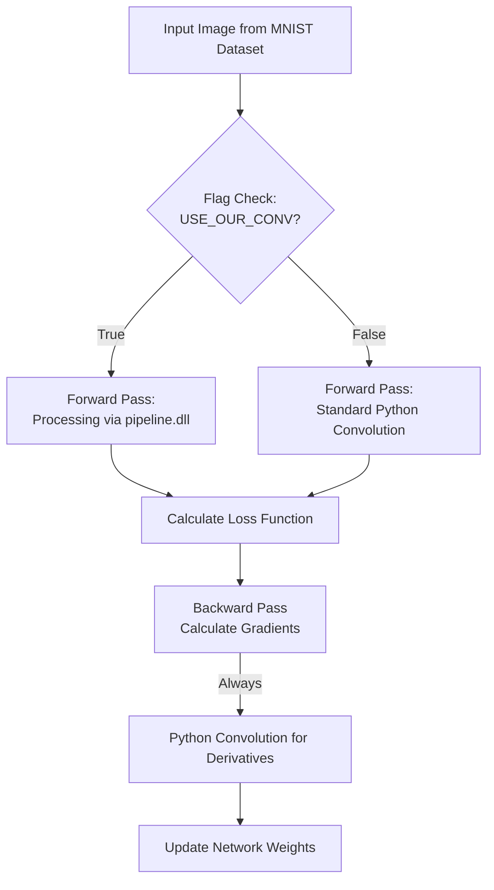

# 🧠 Image Classification & Accuracy Validation (`MNIST_py`)

## 📋 Table of Contents
1. [Overview & Project Goals](#overview)
2. [Directory Structure](#file-structure)
3. [The Comparison Logic (The Flag Mechanism)](#flag-mechanism)
4. [Forward & Backward Pass Integration](#integration)
5. [Dataflow Execution](#execution-flow)
6. [Experimental Results & Accuracy](#results)

---

## 📌 Overview & Project Goals

The `MNIST_py` directory contains the Python-based Convolutional Neural Network (CNN) environment used to evaluate the **classification accuracy** of our custom hardware-oriented convolution architecture. 

The primary goal of this environment is to establish a direct performance comparison between a standard Python/NumPy convolution and our custom C++ pipeline (compiled as a DLL) when trained on the MNIST handwritten digit dataset. This proves that the aggressive architectural simplifications required for our FPGA hardware do not destroy the neural network's ability to learn and classify images effectively.

---

## 📂 Directory Structure

| File | Type | Purpose |
| :--- | :--- | :--- |
| **`MNIST_and_our_conv.py`** | Core Script | The main training and testing script. It contains the CNN architecture, the training loop, and the `ctypes` interface that dynamically loads our custom C++ convolution. |
| **`MNISTdata.hdf5`** | Dataset | A data file containing the 70,000 28x28 grayscale images of handwritten digits (60,000 for training, 10,000 for testing) used to train the network. |
| **`pipeline.dll`** | Dynamic Library | The compiled C++ implementation of our hardware-oriented convolution pipeline. It is called directly from Python during the forward pass. |

---

## ⚖️ The Comparison Logic (The Flag Mechanism)

To evaluate the performance of our architecture against the original model, the script includes a central flag named `USE_OUR_CONV` that allows choosing between two calculation methods:

*   **Original Python Mode (`USE_OUR_CONV = False`):** 
    In this mode, the network uses a standard, basic Python/NumPy convolution (3x3 kernel, stride of 1). This mode serves as the Baseline for testing accuracy percentages.
*   **Custom Convolution Mode (`USE_OUR_CONV = True`):** 
    The network loads the `pipeline.dll` file and uses the convolution we developed (2x2 kernel, stride of 2). In this mode, the MNIST images are automatically padded from 28x28 to 32x32 to fit hardware constraints, and the output (16x16) is expanded back to 26x26 so the subsequent layers in the network can continue operating without modification.

---

## 🔄 Forward & Backward Pass Integration

Integrating our C++ code into the Python network requires specific adaptation and separation between the inference process and the gradient calculation process (weight updating).

*   **Forward Pass:** When `USE_OUR_CONV = True`, the padded 32x32 input array and the 2x2 kernel weights are passed to the C++ DLL. The C++ code processes the image and returns a flat array representing the 16x16 output, which Python then reshapes and expands.
*   **Backward Pass (Gradients):** Calculating the gradient of the kernel (`dK`) requires convolutions with matrices larger than 2x2. Because our custom C++ pipeline strictly supports only 2x2 kernels, the script uses a fallback mechanism: **the backward pass always uses the standard Python convolution**.
*   **Weight Updates:** Despite using Python for the backward pass, the optimizer successfully calculates the gradients and updates the network's weights. These updated weights are then fed back into the C++ pipeline for the next iteration.

---

## 🔀 Dataflow Execution

---

## 📊 Experimental Results & Accuracy

Both models were trained under identical hyperparameters (120,000 iterations, learning rate 0.001, 5 kernels) to evaluate the impact of the hardware constraints on learning.

*   **Baseline Model Accuracy:** ~92.35%
*   **Custom C++ Model Accuracy:** ~91.27%

**Conclusion:** The performance gap between the standard convolution and our constrained, hardware-oriented convolution (2x2 kernel, stride 2, padded inputs) is slightly above 1%. This successfully proves that our highly optimized, parallelizable architecture is fully viable for CNN inference, preserving the predictive capabilities of the network while significantly simplifying the hardware footprint.
