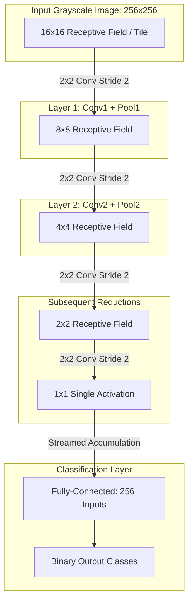
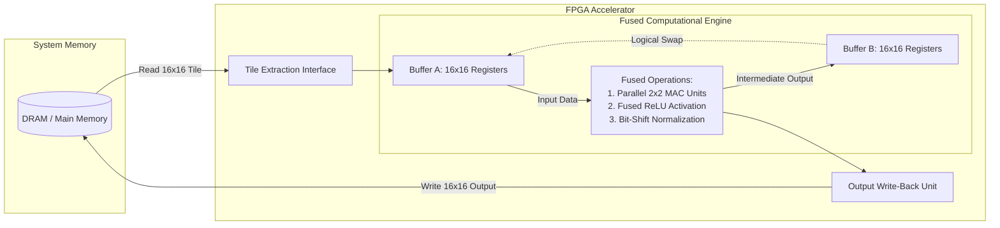

# ⚙️ FPGA-Based CNN Hardware Accelerator for 2D Convolution

## 📌 Project Overview

This project implements a dedicated custom hardware accelerator for two-dimensional (2D) convolution, designed to accelerate Convolutional Neural Networks (CNNs) on an FPGA platform[cite: 1].

The primary motivation is to overcome the **"Memory Wall"** bottleneck[cite: 1]. In standard processors, overlapping sliding windows in convolution require repeatedly fetching the same pixels from external DRAM, causing severe performance degradation[cite: 1]. This architecture resolves the bottleneck by implementing a **Tile-Based Fused Pipeline** with on-chip dual buffering, which maximizes data reuse and minimizes external memory latency[cite: 1].

---

## 🧠 Algorithmic Acceleration Model (Non-Overlapping LWCNN)

The accelerator adopts the fully-fused layer principles from LightWeight CNN (LWCNN) architectures[cite: 1, 16]. By enforcing non-overlapping convolution windows (2x2 kernel with stride 2), the spatial dimension reduces by a factor of 4 at each consecutive layer[cite: 1, 16].



### 🔑 Key Acceleration Principles
* **Non-Overlapping Stride:** The kernel size and stride are identically set to 2, eliminating dependencies between neighboring receptive fields and removing the storage-recalculation dilemma[cite: 16].
* **On-Chip Inter-Layer Streaming:** Intermediate activations produced by each stage are consumed immediately by the next layer in local registers without communicating back to external DRAM[cite: 1, 16].

---

## 🧱 High-Level Hardware Architecture

The accelerator processes scalable input images by fetching fixed-size **16x16 pixel tiles** sequentially from main memory into on-chip registers[cite: 1].



### 🧩 Core Architectural Components

| ⚙️ Component | 🛠️ Hardware Implementation Details |
| :--- | :--- |
| **📥 Tile Extraction Interface** | Manages communication with main DRAM[cite: 1]. Extracts 16x16 pixel tiles to guarantee the computational core has immediate access to required data, reducing memory bandwidth[cite: 1]. |
| **🔄 Double Buffer Mechanism** | Employs two local 16x16 memory banks[cite: 1]. During each stage, one buffer acts as the source while the other stores intermediate results[cite: 1]. The system logically swaps buffers after each stage, achieving **Zero DRAM access** between intermediate stages[cite: 1]. |
| **⚡ Parallel MAC Units** | Exploits data-level parallelism[cite: 1]. Once a full convolution window is available in the local registers, pixels are fed into multiple multipliers simultaneously, executing the Multiply-Accumulate (MAC) operation in a single clock cycle[cite: 1]. |
| **🔗 Fused Pipeline Stages** | Merges MAC, ReLU activation, and bit-shift normalization into a single continuous hardware flow, rather than sequentially writing back to memory after each operation[cite: 1]. |

---

## 📁 Repository Structure

The repository is organized into five main directories, enforcing a strict hardware-software co-design methodology[cite: 1]:

| 📂 Directory | 🎯 Purpose |
| :--- | :--- |
| **`sw/`** | Contains the Bare-Metal C application (`my_conv.c`) that controls the hardware, memory pointers, and Python scripts for generating input matrices and configurations[cite: 1]. |
| **`sim/`** | The cycle-accurate simulation environment[cite: 1]. Contains the Python Golden Reference model (`conv.new.expected.py`), error checking scripts (`check_conv_error.py`), and the runtime `t0` directory[cite: 8, 9]. |
| **`hw/`** | Contains all SystemVerilog (RTL) files for the hardware datapath, parallel MAC units, and FSM control logic[cite: 1]. |
| **`mnist_py/`** | An independent Python validation environment used to evaluate the hardware constraints (stride-2, 2x2 kernels, symmetric padding) against the MNIST dataset[cite: 1, 14]. |
| **`cpp_code/`** | The legacy baseline C++ implementation (`pip.cpp`), developed during Phase 1 for algorithmic validation prior to the Bare-Metal adaptation[cite: 1, 11]. |

---

## 🚀 Execution & Simulation Guide

### ☁️ Option A: BIU K5 Cloud Environment

To run the simulation in the cloud environment, open **two separate terminal sessions**. In **both** terminals, initialize the K5 environment (which automatically navigates to the required simulation directory):

```bash
set_k5_terminal
```

**Terminal 1 (Hardware Simulator):**
```bash
launch_k5_sim my_conv
```

**Terminal 2 (Bare-Metal Application):**  
*(Note: The host C application automatically triggers the Python test vector generation script before execution).*
```bash
launch_k5_app my_conv -ccd1 XON -itr 1
```

---

### 🪟 Option B: Windows FPGA Environment

To deploy and execute the design locally on the physical FPGA board, use the Git Bash (or MINGW64) terminal on Windows[cite: 17].

**1. Initialize the Environment (Once per session):**  
Navigate to the local K5 installation directory and load the environment[cite: 17]:
```bash
cd /c/k5x_win
source k5_xbox_fpga_win/setup/build_env.sh
set_k5_terminal
```

**2. Program the FPGA & Run:**  
Ensure your generated `.sof` bitstream file is placed in the `$FPGA_PROG_FILES` directory[cite: 17]. Then, program the board and launch the application[cite: 17]:
```bash
prog_fpga my_conv
launch_k5_app my_conv
```