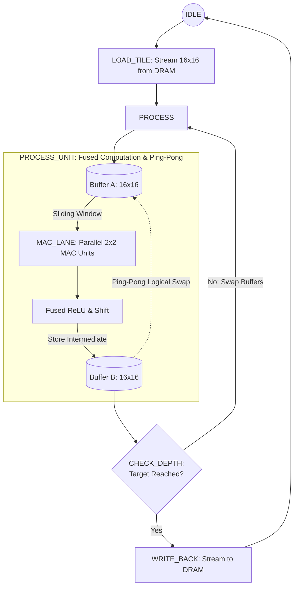

# 🔧 Hardware Accelerator RTL & Architecture (`hw`)

## 📌 Overview

The `hw` directory contains the SystemVerilog Register-Transfer Level (RTL) implementation of the dedicated 2D convolution hardware accelerator.

This custom module is purpose-built for deployment on FPGA platforms within the K5 environment. It leverages the programmable fabric of the FPGA to deliver a highly efficient, parallelized computational core for Convolutional Neural Networks (CNNs)[cite: 1].

---

## 🧱 Micro-Architecture & FSM Dataflow

The accelerator is driven by a Finite State Machine (FSM) that dictates the flow of data from the main memory, through the processing units, and back to memory. The execution corresponds directly to the sub-modules in this directory, incorporating a ping-pong double-buffering mechanism within the core processing stage.



---

## 🧩 Sub-Module Hierarchy & Description

The hardware design is highly modular. The top-level module instantiates the individual state units, which control the datapath and computation lanes.

| ⚙️ Module | 🛠️ Implementation Details |
| :--- | :--- |
| **`my_conv16.sv`** | **Top-level hardware wrapper.** Manages the host register interface, memory-mapped handshakes (`START`, `DONE`), and routes signals between the FSM sub-units. |
| **`idle_unit.sv`** | **Standby State.** Monitors the host interface and waits for the `START` signal to begin processing a new image or tile. |
| **`load_tile_unit.sv`** | **Input Interface.** Responsible for fetching the input tile from system memory (DRAM) and storing it into the local BRAM/registers. |
| **`process_unit.sv`** | **Core Execution State.** Manages the double-buffering logic and pipeline. It applies the convolution window across the tile, incorporates ReLU activation, and handles bit-shift scaling. |
| **`mac_lane.sv`** | **Arithmetic Core (Sub-module of `process_unit`).** Contains the parallel multipliers and adder tree to perform the core Multiply-Accumulate (MAC) operations in a single clock cycle. |
| **`check_depth_unit.sv`** | **Validation State.** Evaluates if the recursive convolution process has reached the target resolution (16x16 output). If not, it triggers a buffer swap to continue processing. |
| **`write_back_unit.sv`** | **Output Interface.** Streams the final, processed 16x16 feature map from the local buffers back into the designated system memory (DRAM) addresses. |

---

## 🎛️ Host Memory-Mapped Interface (CSRs)

The host processor (Bare-Metal C code) controls the hardware accelerator via dedicated Control and Status Registers (CSRs) configured over the memory bus:

*   **Pointers & Addresses:** The host provides the base addresses for the input image, the convolution kernels, and the destination output buffer.
*   **Configuration:** The host passes architectural parameters such as `IMAGE_SIZE` and `STRIDE`.
*   **Handshake (`START` / `DONE`):** The CPU writes `1` to the `START` register to trigger the `idle_unit`, and continuously polls the `DONE` register until the `write_back_unit` asserts it.

---

## 🛠️ FPGA Synthesis & Compilation Flow

Synthesis, static timing analysis (STA), and bitstream generation are performed exclusively in the **BIU K5 Cloud Environment**.

To run the compilation chain, use the following commands:

### 1. Initialize Cloud Environment
Open a terminal in the BIU-Engineering cloud environment and initialize the QSYN utility (needed just once per installation):
```bash
source /project/tsmc65/shared/qsyn/util/qsyn_install.sh
```

### 2. Full Fit and Static Timing Analysis (STA)
Navigate to the accelerator's hardware directory to verify synthesizability, feasibility, and timing by running the complete synthesis flow (`-all`):
```bash
cd $MY_K5_XLRS/my_conv16
qsyn_xlr my_conv16 -all
```

### 3. Generate Platform Bitstream (`.sof`)
Navigate to the FPGA bitstream generation folder and compile the complete FPGA system, integrating your custom accelerator:
```bash
cd $MY_K5_PROJ/hw/gen_fpga
comp_fpga my_conv16
```
*(The generated `k5_xbox_my_conv16.sof` file can then be downloaded from `$MY_K5_PROJ/hw/gen_fpga/prog_files/` and flashed onto the physical FPGA board using the local Windows environment).*
